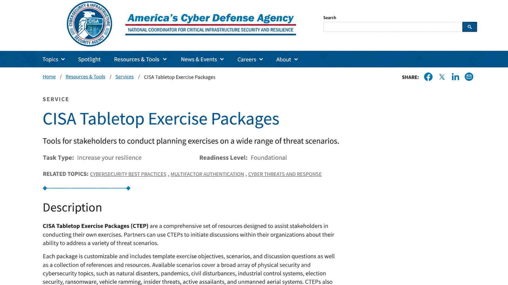

# CISA-Informed Ransomware Tabletop Exercise

## Project Overview

This project documents a simulated ransomware tabletop exercise for **TechNova**, a fictional cloud-based SaaS company. The exercise was designed using the structure described by the U.S. Cybersecurity and Infrastructure Security Agency's Tabletop Exercise Packages and ransomware guidance.

The project demonstrates how a GRC analyst can plan an exercise, coordinate business and technical stakeholders, test incident-response decisions, document gaps, assign corrective actions, and map results to the NIST Cybersecurity Framework 2.0.

> **Portfolio disclaimer:** TechNova, its personnel, systems, and exercise results are fictional. This educational simulation is not an official CISA exercise, production assessment, or certification.

## Scenario Summary

At 8:15 a.m., TechNova employees report inaccessible files and ransom notes on shared drives. Investigation reveals compromised administrator credentials, encrypted Windows servers, unavailable customer-support systems, suspected data exfiltration, and an approaching regulatory notification deadline. Participants must manage containment, continuity, legal notification, customer communication, recovery, and executive decision-making.

## Exercise Objectives

- Validate ransomware detection and escalation procedures.
- Confirm incident-command roles and decision authority.
- Test coordination among Security, IT, Legal, Privacy, Communications, and executive leadership.
- Evaluate backup integrity and recovery priorities.
- Examine notification, evidence-preservation, and ransom-decision procedures.
- Identify gaps and assign measurable remediation actions.

## Repository Contents

| File | Purpose |
|---|---|
| `exercise-plan.md` | Scope, objectives, assumptions, participants, and schedule |
| `facilitator-guide.md` | Facilitation instructions, inject sequence, and discussion prompts |
| `participant-guide.md` | Participant rules, roles, and exercise expectations |
| `scenario-injects.csv` | Timed scenario events, expected actions, and evaluation criteria |
| `after-action-report.md` | Simulated observations, strengths, gaps, and conclusions |
| `improvement-plan.csv` | Corrective actions, owners, priorities, due dates, and success measures |
| `nist-csf-mapping.csv` | Exercise activities mapped to NIST CSF 2.0 outcomes |
| `evidence-checklist.md` | Evidence an assessor would request to validate readiness |

## Key Findings

### Strengths

- The incident was escalated quickly and an incident commander was assigned.
- IT isolated affected systems without destroying volatile evidence.
- Offline backups were available and a clean recovery environment was identified.
- Legal, Privacy, and Communications teams joined the response early.

### Gaps

- The incident-response contact roster contained outdated information.
- Ransom-payment authority and decision criteria were not formally documented.
- Backup restoration testing did not include the customer-support platform.
- The data-breach notification matrix lacked state-specific escalation triggers.
- A preapproved customer communication template was unavailable.

## Risk Ratings

| Risk | Likelihood | Impact | Rating |
|---|---:|---:|---:|
| Credential compromise and ransomware execution | 4 | 5 | Critical 20 |
| Extended customer-service outage | 4 | 4 | High 16 |
| Exposure of regulated customer data | 3 | 5 | High 15 |
| Failed or delayed restoration | 3 | 4 | High 12 |

Scoring uses a simulated 5 x 5 likelihood-impact model.

## Improvement Priorities

1. Update and test the incident-response contact roster.
2. Approve a documented ransomware payment decision framework.
3. Expand restoration testing to all Tier 1 business services.
4. Complete a jurisdiction-specific breach notification matrix.
5. Approve customer and regulator communication templates.

## Skills Demonstrated

- Tabletop exercise planning and facilitation
- Ransomware incident-response governance
- Cross-functional stakeholder coordination
- Business continuity and disaster recovery analysis
- Risk identification and scoring
- Control validation and evidence planning
- NIST CSF 2.0 mapping
- After-action reporting and corrective-action tracking

## References

- [CISA Tabletop Exercise Packages](https://www.cisa.gov/resources-tools/services/cisa-tabletop-exercise-packages)
- [CISA StopRansomware Guide](https://www.cisa.gov/stopransomware/ransomware-guide)
- [NIST Cybersecurity Framework 2.0](https://www.nist.gov/cyberframework)

## Source Research Screenshot

## Author

**Darwin Brown Jr.**  
[GitHub Profile](https://github.com/browndarwin231-Tech)
